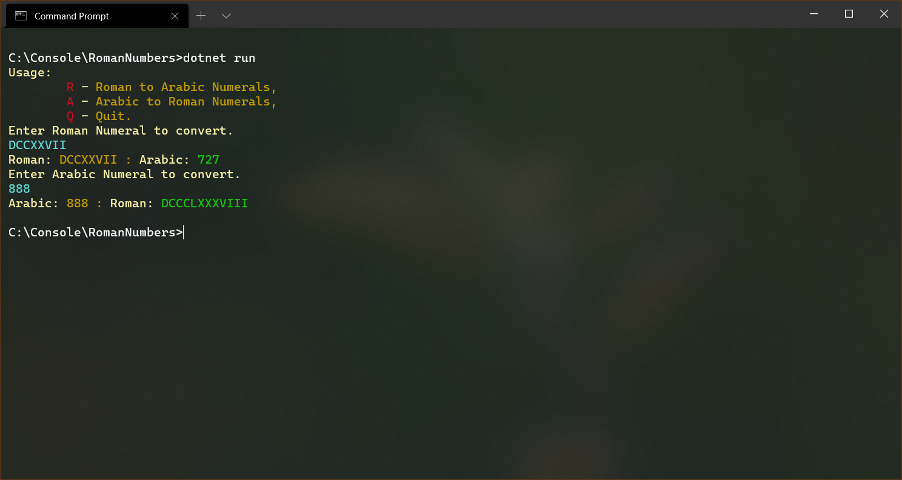

# RomanNumbers
Conversions between Roman numerals and Arabic numbers.

# Usage instructions
Console application written using .NET 5.
Running <b>dotnet run</b> command inside directory containing code will start application.
Strings inside code contain color codes, that can be displayed only using Command Prompt used by .NET Core or Windows Terminal.

# Screen
Basic usage of the application:

